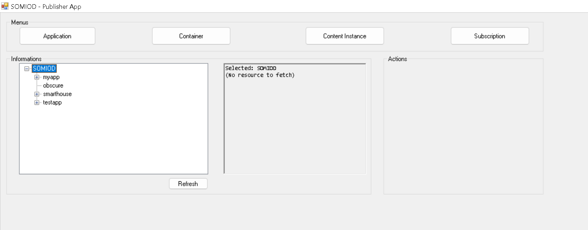
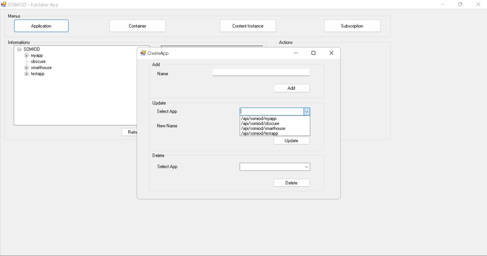
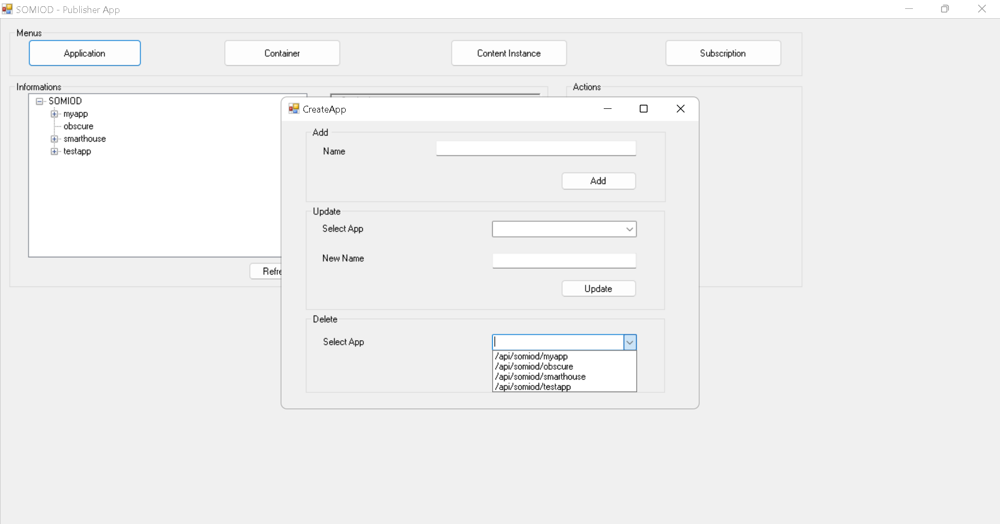
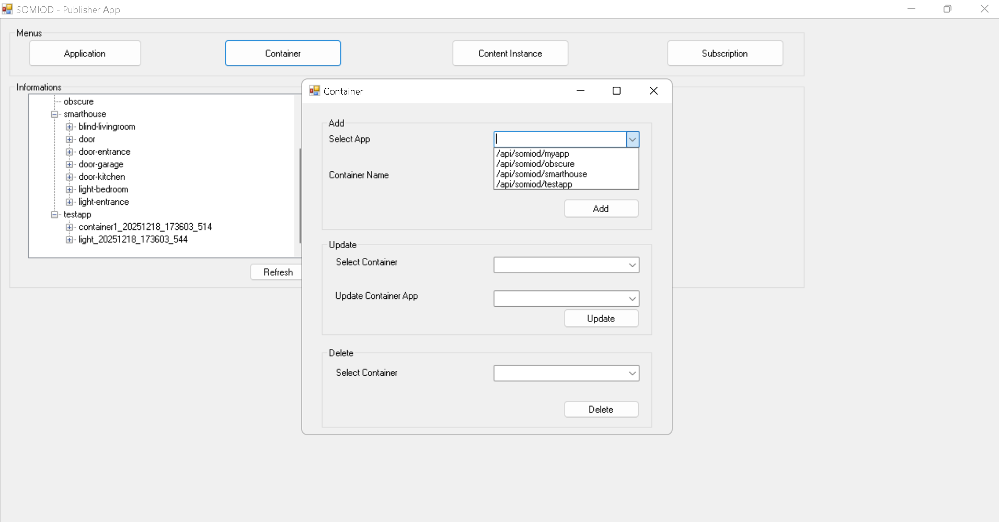
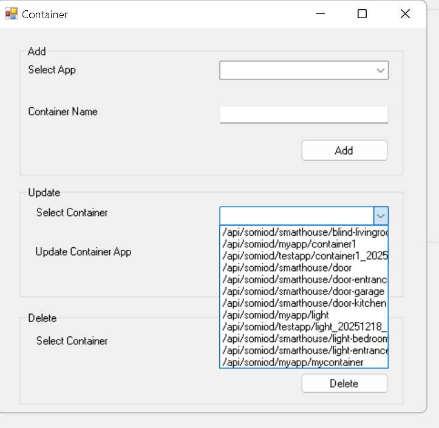
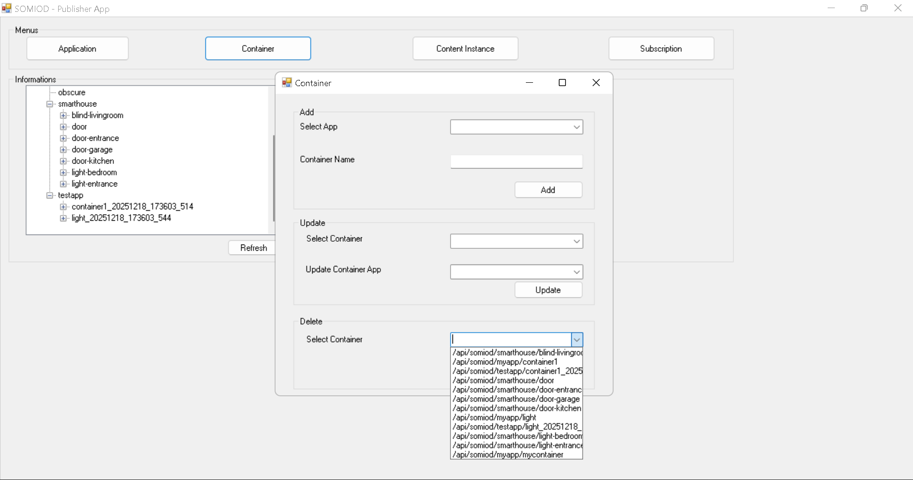
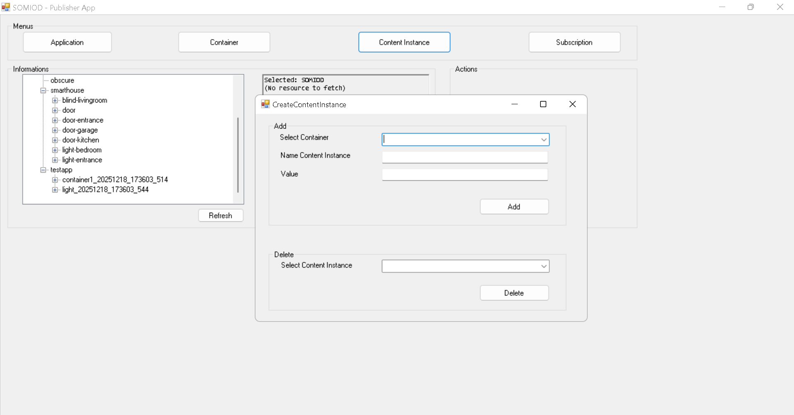
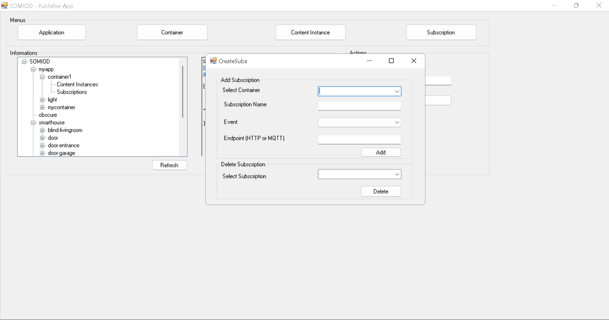
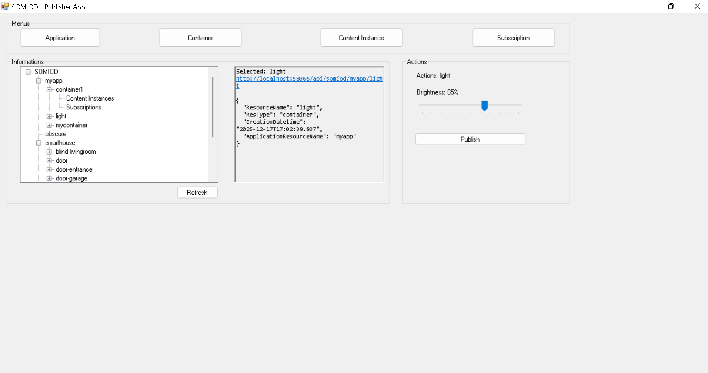

# SOMIOD IoT Middleware

A RESTful middleware service for managing IoT resources and pushing notifications to subscribed endpoints. The project is built on **ASP.NET Web API (.NET Framework 4.8)** with **SQL Server** as the persistence layer and ships with two Windows Forms clients: a **Publisher** for browsing and managing resources, and a **Subscriber** for receiving notifications in real time.



---

## ✨ Features

- **Resource hierarchy** — `Application` → `Container` → `Content Instance`, plus `Subscription` resources attached to containers.
- **Discovery via custom HTTP header** — clients send `somiod-discovery: <resource-type>` to list children of any resource in the hierarchy.
- **CRUD over REST** — full GET / POST / PUT / DELETE on every resource type, returning JSON payloads with snake-case field names (`resource-name`, `res-type`, `creation-datetime`, etc.).
- **Push notifications** — when a `content-instance` is created or deleted, the middleware fans the event out to every matching subscription endpoint, over either **HTTP (webhook)** or **MQTT (publish/subscribe)**.
- **Notification filtering** — each subscription carries an `evt` bitmask (`1 = creation`, `2 = deletion`) so subscribers can opt into only the events they care about.
- **Two demo clients** — `SomiodPublisher` and `SomiodSubscriber` Windows Forms apps that exercise every endpoint of the API in a real smart-home scenario (lights, doors, blinds, etc.).

---

## 📦 Project layout

```
somiod-iot-middleware/
├── ProjetoIs/                # ASP.NET Web API service (the middleware)
│   ├── Controllers/          # application, container, content-instance, subscription
│   ├── Models/               # Entity classes mapped to SQL tables
│   ├── Services/             # NotificationService (MQTT + HTTP fan-out)
│   ├── App_Start/            # WebApiConfig (attribute routing)
│   └── ...
├── TestApplications/         # WinForms "SomiodPublisher" client
│   ├── Form1.cs              # Resource tree view + per-container actions
│   ├── CreateApp.cs          # Application create / delete form
│   └── ...
├── SomiodSubscriber/         # WinForms MQTT subscriber client
│   ├── Form1.cs              # Notification handler + device-state simulation
│   └── Services/             # MqttListener, NotificationXmlService
├── application.sql           # SQL schema: application table
├── container.sql             # SQL schema: container table
├── content-instance.sql      # SQL schema: content-instance table
├── subscription.sql          # SQL schema: subscription table
├── identification.txt        # Project authors
└── img/                      # Screenshots used in this README
```

---

## 🧱 Resource model

Every resource inherits the base fields defined in `Models/common.cs`:

| Field | JSON name |
|---|---|
| Resource name (unique key) | `resource-name` |
| Resource type discriminator | `res-type` |
| Creation timestamp (UTC) | `creation-datetime` |

### Hierarchy

```
Application  (e.g. "smarthouse")
└── Container        (e.g. "door-livingroom", "light", "blind-kitchen")
    ├── Content Instance   (one reading/state of a device)
    └── Subscription       (push target for that container's events)
```

- `container.application-resource-name` is a foreign key back to the parent `Application`.
- `content-instance.container-resource-name` is a foreign key to the parent `Container`.
- `subscription.container-resource-name` is a foreign key to the parent `Container`.
- `subscription.evt` is a bitmask — `1 = Creation`, `2 = Deletion`.
- `subscription.endpoint` accepts either an `http(s)://...` URL or an MQTT broker address (`host[:port]`).

---

## 🔌 HTTP API

All routes share the prefix `api/somiod` (see `ProjetoIs/Controllers/applicationController.cs`). The middleware listens on `http://localhost:58066` by default.

| Method | Route | Description |
|---|---|---|
| `GET`  | `/api/somiod`                       | List applications (default) **or** any other resource type when `somiod-discovery` header is supplied. |
| `GET`  | `/api/somiod/{application}`         | Get an application, **or** discover its containers / content-instances / subscriptions via `somiod-discovery`. |
| `POST` | `/api/somiod`                       | Create a new application. |
| `POST` | `/api/somiod/{application}`         | Create a container under the given application. |
| `PUT`  | `/api/somiod/{application}`         | Refresh an application (updates its `creation-datetime`). |
| `DELETE` | `/api/somiod/{application}`       | Delete an application. |
| `GET` / `POST` / `PUT` / `DELETE` | `/api/somiod/{application}/{container}[/subs/{subscription}]` | Same operations on containers, content-instances and subscriptions. |

### `somiod-discovery` header

The same endpoint (`GET /api/somiod` or `GET /api/somiod/{app}`) returns different lists depending on the header value:

```http
GET /api/somiod
somiod-discovery: application

GET /api/somiod
somiod-discovery: container

GET /api/somiod
somiod-discovery: content-instance

GET /api/somiod
somiod-discovery: subscription
```

This lets clients walk the tree using a single, predictable URL shape.

---

## 🔔 Notifications

`Services/NotificationService.cs` is invoked after every `content-instance` create / delete. It:

1. Joins `subscription` against `container` and filters by the matching `evt` bitmask.
2. Builds the JSON payload:
   ```json
   {
     "eventType": "creation",
     "resourceType": "content-instance",
     "resourcePath": "/api/somiod/myapp/light/ci_20251217_170238",
     "subscription": "front-door-listener",
     "timestamp": "2025-12-17T17:02:38"
   }
   ```
3. Dispatches each subscription's `endpoint`:
   - If it starts with `http` → POST the payload to that webhook.
   - Otherwise → connect to that MQTT broker (`uPLibrary.Networking.M2Mqtt`) and publish to the topic `api/somiod/{app}/{container}`.

The `SomiodSubscriber` client subscribes to `api/somiod/#`, pulls the referenced content-instance via HTTP, parses its `value` field and simulates the device action (e.g. changing the brightness of a light, opening/closing a door, moving blinds).

---

## 🖥️ SomiodPublisher (WinForms client)

`TestApplications/Form1.cs` provides a tree view of the entire SOMIOD hierarchy. Buttons along the top open dedicated forms to **create / update / delete** each resource type.


### Create / update an application

The `CreateApp` form POSTs `{"resource-name": "<name>"}` to the API. Names are validated against an allow-list of letters and digits, and the server is consulted first to avoid collisions.



### Delete an application

The same form lets you pick an existing application and remove it via DELETE.



### Create a container

A container is created with `POST /api/somiod/{application}` and is parented to the selected application.



### Update / delete a container

Mutations on a container update its `creation-datetime` and remove the row respectively.




### Create and delete content instances

Selecting a container exposes **device-specific actions** (open/close door, dim light, move blinds). Each click publishes a fresh `content-instance` whose `content` field carries the command as JSON.



### Create a subscription

A subscription needs a parent container, a name, an event filter (`Creation`, `Deletion` or both) and an endpoint — either `http://...` for a webhook or `host[:port]` for an MQTT broker.



### Publishing to a real IoT device

When the publisher is aimed at a "light" container, the right-hand panel exposes a brightness slider that publishes percentage values straight to SOMIOD — these get fanned out as notifications to any subscribed endpoint (e.g. the `SomiodSubscriber`).



---

## 📡 SomiodSubscriber (WinForms client)

`SomiodSubscriber/Form1.cs` connects to `localhost:1883` and subscribes to the wildcard topic `api/somiod/#`. For every received notification it:

1. Logs the event.
2. Calls `GET` on the notification's `resourcePath` to fetch the full content-instance.
3. Parses the `content.value` and dispatches the command to the matching simulated device (door open/close, brightness %, blind position).
4. Updates the on-screen state image (door open/closed, brightness levels, blind positions).
5. Persists each notification as validated XML through `NotificationXmlService`.

This is what closes the loop: **Publisher → SOMIOD → Notification → Subscriber → device**.

---

## 🗃️ Database

The schema is shipped as plain SQL scripts — run them against a SQL Server instance before starting the API:

- `application.sql`
- `container.sql`
- `content-instance.sql`
- `subscription.sql`

The connection string is read from `ProjetoIs.Properties.Settings.ConnectionString` in the Web API configuration.

---

## ⚙️ Tech stack

- **ASP.NET Web API** on **.NET Framework 4.8** with attribute routing (`config.MapHttpAttributeRoutes()`).
- **SQL Server** with hand-written `SqlCommand` / `SqlDataReader` code in the controllers.
- **Newtonsoft.Json** for JSON serialization (snake_case property names).
- **`uPLibrary.Networking.M2Mqtt`** for publishing notifications to MQTT brokers.
- **Windows Forms** for both the publisher and subscriber demo clients.
- **RestSharp** for HTTP calls from the publisher forms (used in addition to `HttpClient`).

---

## 👥 Authors

Project developed at **IPLeiria**:

- José Branco 
